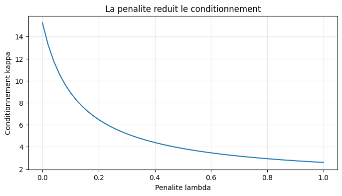
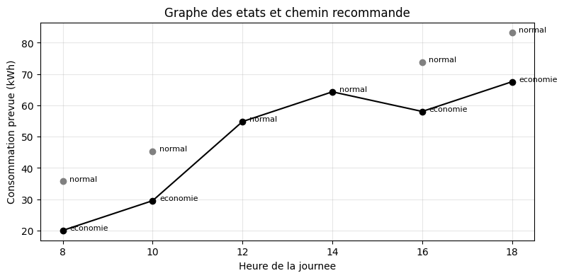
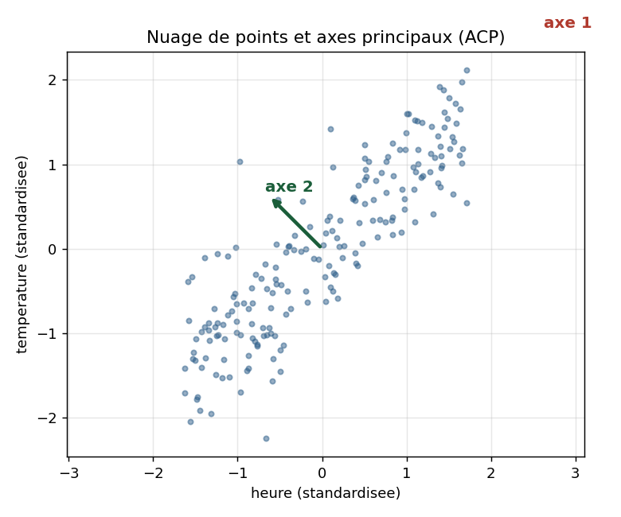

# Smart Energy Pilot

Prédiction et pilotage intelligent de la facture d'électricité d'un bâtiment.
Un modèle de régression pénalisée apprend la consommation à partir de relevés
horaires, puis un graphe d'états recommande quand réduire la dépense sans gêner
le confort.

## Le projet

Un gérant d'immeuble de bureaux voit sa facture d'électricité augmenter sans en
comprendre les causes. À partir de relevés horaires (température, occupation,
consommation), ce projet construit un outil qui fait deux choses : prédire la
consommation à venir, puis recommander des créneaux concrets de réduction.

Le travail relie trois domaines des mathématiques appliquées : l'algèbre
linéaire pour représenter et réduire les données, la statistique pour valider le
modèle, et l'optimisation pour l'estimer et pour trouver le meilleur plan.

## Démonstration en ligne

Une page web exécute le vrai code Python dans le navigateur, sans installation.
Réglez la pénalité et le pas d'apprentissage, puis observez les poids, le
conditionnement, la convergence et le plan recommandé se recalculer en direct.

Adresse une fois GitHub Pages activé :
`https://traore352.github.io/smart_energy_pilot/`

## Ce que fait le projet

* Estimation des poids par deux méthodes qui coïncident : équations normales et descente de gradient.
* Étude du conditionnement et preuve que la pénalisation le réduit.
* Analyse statistique avec intervalles de confiance des poids.
* Recommandation par graphe d'états et recherche du chemin de plus faible consommation.
* Résultat validé : environ 18 pour cent d'économie à confort égal.

## Structure du dépôt

```
smart_energy_pilot/
  src/            code Python modulaire
    data.py         generation des donnees
    model.py        cout, gradient, estimation, intervalles de confiance
    conditioning.py conditionnement et effet de la penalite
    graph.py        graphe des etats et recommandation
    main.py         execute toute la chaine et affiche les resultats
  notebook/       carnet Jupyter complet, dans l'ordre du rapport
  web/            page web interactive (Pyodide)
  docs/           rapport scientifique et figures
  requirements.txt
  LICENSE
```

## Installation et utilisation

Cloner le dépôt puis installer les dépendances :

```
git clone https://github.com/TRAORE352/smart_energy_pilot.git
cd smart_energy_pilot
pip install -r requirements.txt
```

Lancer la chaîne complète en ligne de commande :

```
python src/main.py
```

Ouvrir le carnet Jupyter pour parcourir le projet section par section :

```
jupyter notebook notebook/Notebook_Groupe4.ipynb
```

## Résultats

Le conditionnement décroît avec la pénalité, ce qui stabilise l'apprentissage :



Le graphe des états et le chemin recommandé sur une journée type :



L'analyse en composantes principales sur les deux variables corrélées :



Le rapport scientifique complet, au format de l'Académie des Mathématiques
Appliquées, se trouve dans `docs/rapport_ama.pdf`.

## Équipe

Projet réalisé par le Groupe 4 du Programme d'Introduction à l'Intelligence
Artificielle de l'Académie des Mathématiques Appliquées :
Laïs Hindeme, Zozerigué Traoré, Benoît Djossou, Pacifique Lubungu,
Eléazar Dègnon Samuel Tognon et Emilienne Adangnissode.
Encadrement : Ing. Charbel.

## Références

* C. Mamlankou, Mathématiques fondamentales pour l'IA, Académie des Mathématiques Appliquées.
* G. James, D. Witten, T. Hastie, R. Tibshirani, An Introduction to Statistical Learning, Springer.
* T. Cormen, C. Leiserson, R. Rivest, C. Stein, Introduction to Algorithms, MIT Press.

## Licence

Ce projet est distribué sous licence MIT. Voir le fichier `LICENSE`.
